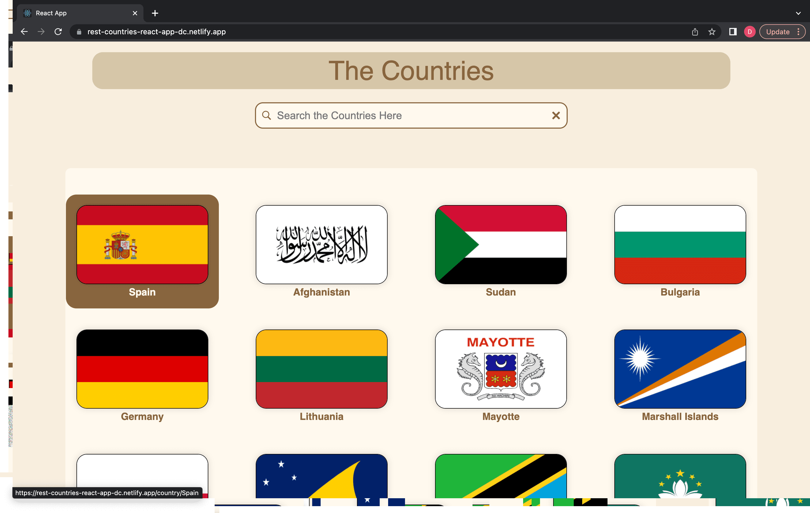
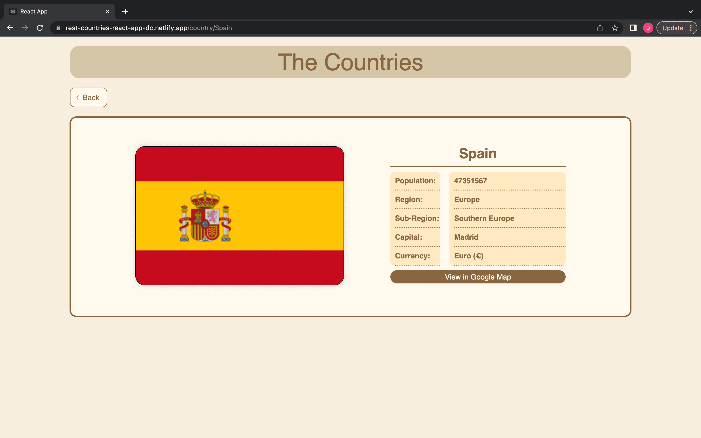
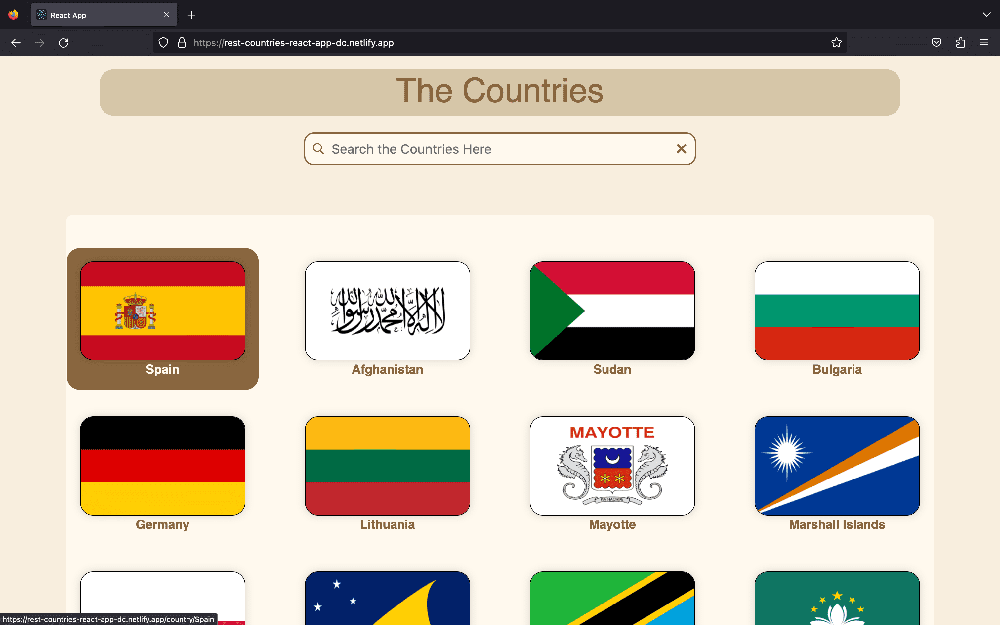
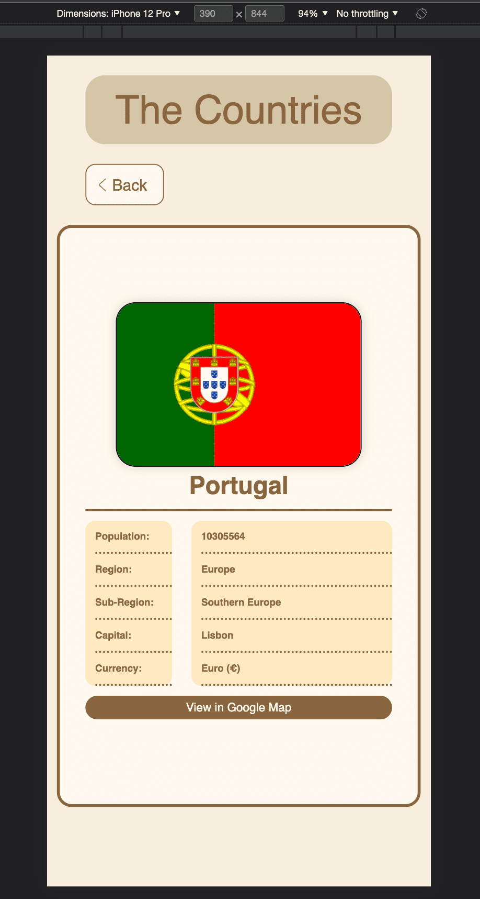
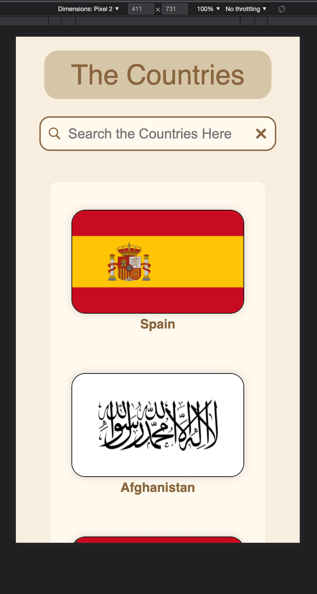
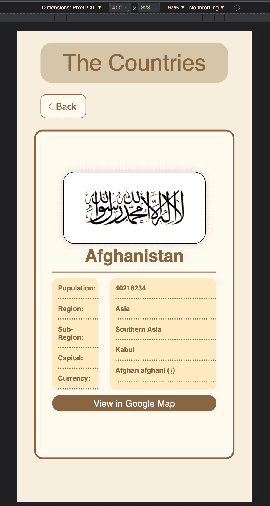

# rest-countries-react-app

To run the project locally

1. git clone the project repo

2.  npm install

3. npm start

 

Here is a link to view the site:-

https://rest-countries-react-app-dc.netlify.app/

 

<Strong>
Project Description
</Strong>

1. The first page has a search bar which display list of countries according to the keyword searched
2. After clicking on the selected country, the next page shows the selected country details
3. All the countries data is obtain from https://restcountries.com/ API

 

## Screenshots

<Strong><u>Web Browser</u></Strong>

<Strong>Google</Strong>

 

 

 

   

<Strong>Safari</Strong>

 

 

 

   

<Strong>Firefox</Strong>

 

 

 

  

<Strong>Various Devices</Strong>

IPhone 12 Pro

 

  

IPhone SE

 

  

IPad Air

 

  

Pixel 2

 

  

Pixel 2 XL

 

  

Surface Pro 7

 

  

